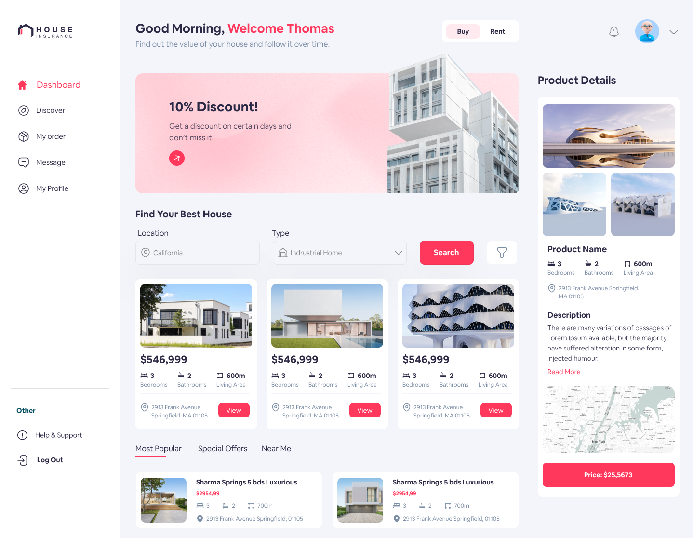

# Figma Design Integration with Vue

This project is a integration of a Figma design using the Vue, TypeScript and TailwindCSS.

---

## Design Overview

Here is the Figma design to be implemented :

Link to the design: [View on Figma](https://www.figma.com/design/0ZJaU4ehituJzzPbTXmZbI/Real-Estate-Dashboard?node-id=0-1&p=f&t=ZZK77b5JLtUgLxKg-0)

---

## Technologies Used

- Vue
- TypeScript
- TailwindCSS

---